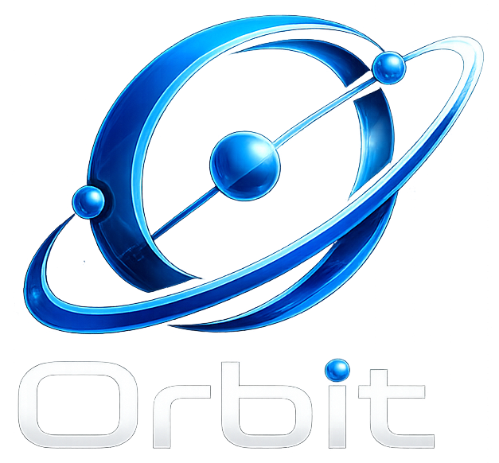

<div align="center">



# 🛰️ Orbit — Quality Workspace Management

### AI-powered accreditation, project delivery & team collaboration — for the modern university.

<p>
  
  
  
  
</p>

<p>
  
  
  
  
  
  
  
  
  
</p>

</div>

---

## 📖 Overview

**Orbit** is a native Android client for a **university Quality Assurance & workspace-management platform**. It unifies everything an institution needs to run accreditation and delivery in one place — **multi-team project tracking, Kanban workspaces, real-time channels, an AI quality-control pipeline, role-based dashboards, and dedicated IT & Founder consoles**.

The app is a **100% Jetpack Compose** rewrite built from the ground up with **Clean Architecture + MVVM**, talking to a **FastAPI + MongoDB** backend with **Google Gemini** powering the AI report evaluation. Every screen ships with **full Dark / Light / System theming** and **bilingual support (English + Egyptian Arabic)** — no hardcoded strings.

> **Pass threshold:** AI report submissions are scored 0–100; the UI accepts at **≥ 70%** and the backend stores a pass at **≥ 85%** across **20 accreditation report types**.

---

## ✨ Deep-Dive Features

### 🔐 Authentication, Sessions & Boot
- **System boot gate** — checks `GET /system/init-status` (8s timeout) → routes to **Setup Wizard** (first-run Founder creation), **Backend-Down** screen (10s auto-retry ring), or the app.
- **JWT login** with role-based redirect, session tracking, audit logging, and **token-blacklist logout**.
- **Maintenance mode** & **force-logout** awareness from the auth layer.
- Headers on every call: `Authorization: Bearer <jwt>` + `X-User-Id`.

### 👥 Role-Based Access Control (RBAC) — 2 Tiers
- **8 platform roles:** `founder`, `it_staff`, `admin`, `manager`, `sub_admin`, `staff`, `quality_control`, `quality_manager`.
- **Dynamic role-based Bottom Navigation** — each role gets its own destination set, with overflow collapsed into a **“More”** sheet.
- **Navigation guards** restrict routes per role (staff lockouts, QC circle, founder-only, sub-admin dashboards) and redirect default dashboards.
- **Team-creation hierarchy:** an **Admin** can assign Sub-Admins + Staff; a **Sub-Admin** can assign **Staff only** — selection lists filter dynamically by the current user’s role.

### 🗂️ Workspaces, Projects, Teams & Tasks
- Projects with tabs/filters (All / Active / Progress / Public), full **CRUD via Bottom Sheets**, and inline team management.
- **Teams & memberships** CRUD, team details, and a **performance leaderboard**.
- **Create Task** flow with multi-assignee, assign-to-all, visibility, priority, and report-type selection.

### 📌 Kanban Workspace ⭐
- 4 live columns (`todo / in_progress / review / done`) with color coding, rich cards (multi-assignee, due-date tinting, report type), and **inline create**.
- **Optimistic status moves with rollback** on failure.
- **Task Detail Sheet** (Info / Discussion / Files / AI) + side panels (Team / Chat / Files).
- **WebSocket live updates** (`ws/{projectId}?token=`) with silent refetch, plus refetch-after-action fallback.

### 📣 System Channels (TaskFlow)
- Gradient channel headers, typed posts (`announcement / task / note`), threaded replies, and **@mentions**.
- Client-side **emoji reactions**, attachments with image preview, resources, todos, and an activity feed.

### 🤖 AI Quality-Control Pipeline ⭐
- **20 accreditation report types** (course, program, self-study, surveys, HR, research ethics, …) loaded dynamically (AR/EN).
- **Submit Sheet** (Bottom Sheet): drag-drop PDF/Word/images → **chunked Base64 encoding** → `POST /quality/evaluate`.
- Result screen: **compliance score**, passed/failed standards, suggestions, report-type compliance & **3-second auto-submit** on success.
- **AI history**, per-type **template downloads** (AR/EN), and staff task verdicts.

### 🧪 QC Suite & 🤝 Chatbot
- **QC Dashboard** — 5 tabs (Intelligence / Overview / Standards CRUD / Evaluations / Analytics) + a **16-week activity heatmap** and CSV/PDF export.
- **Quality Insights** (last 60 days) with report downloads.
- Floating **Orbit AI chatbot** (Gemini passthrough) with greeting, typing indicator, unread badge & bold formatting — hidden inside the workspace.

### 📊 Reports, Portals & Calendar
- **Reports** — platform KPIs + custom Compose charts; **SubAdmin Portal** & **TaskMaster** analytics; **Portfolio** profiles.
- **Calendar** — month grid + full event CRUD (10 types, 4 visibilities, recurrence, reminders) and **RSVP**.

### 🛠️ IT Console & 👑 Founder Suite
- **IT Console** — sectioned dashboard (users, roles, security, sessions, audit, health, settings, profile) with full **user management** (create / edit / reset password / force-logout / delete) and a maintenance toggle.
- **Configuration & Session Logs** pages.
- **Founder Command Center** — health gauge + KPIs, MRR & tier distribution, 7-day AI trends, system alerts, plus **Frameworks** and **Entities** management & IT-account administration.

### 🎨 UX, Motion & Polish
- **Onboarding** flow rebuilt to mirror the web **landing page** — animated orbit-core (rotating rings + glowing logo), gradient hero, and mission-feature pages.
- **Smart network usage:** ViewModels fetch once on entry (no re-fetch on recomposition); refresh is **swipe-to-refresh** or **on-return** only (live screens — chat, Kanban, calendar, notifications — excepted).
- **Micro-interactions:** animated text-field focus rings, **bouncy Bottom-Nav** with an active **pop-up (translationY)** icon, and **staggered card entrances**.
- **Clickable notification routing** — taps mark-as-read and **dynamically route** by type & id (Task Details, Team Page, Project board, or Channel mention).
- **Custom charts engine** — speedometer **gauges**, sparklines, progress rings, donuts, bar/area charts and heat grids drawn on `Canvas`.
- **Branded adaptive launcher icon** + correctly-scaled system splash screen.

---

## 🧱 Tech Stack & Architecture

| Layer | Technology |
|------|-------------|
| **Language** | Kotlin 2.0.21 |
| **UI** | Jetpack Compose (BOM 2024.09.00), Material 3, Navigation-Compose, Material Icons Extended |
| **Architecture** | Clean Architecture + **MVVM** (per-screen ViewModel, `StateFlow` + `collectAsStateWithLifecycle`) |
| **DI** | Hilt 2.52 + Hilt-Navigation-Compose |
| **Networking** | Retrofit 2.11 · OkHttp 4.12 (Bearer / `X-User-Id` interceptors) · OkHttp **WebSocket** · kotlinx-serialization 1.7.3 |
| **Async** | Kotlin Coroutines 1.8 + Flow |
| **Storage** | Jetpack **DataStore** (session, theme, language, onboarding flag) |
| **Images** | Coil 2.5 |
| **System** | Core SplashScreen API, Edge-to-Edge |
| **Backend** | FastAPI + MongoDB · **Google Gemini** (AI evaluation) |
| **Build** | AGP 8.13.2 · KSP · minSdk 24 / target 36 |

### 📁 Project Structure

```
app/src/main/java/com/orbit/mobile/
├─ core/        # network · datastore · theme · l10n · ui (components, charts) · util
├─ data/        # dto · api (Retrofit) · repository implementations
├─ domain/      # models · repository interfaces · use cases
└─ feature/     # one Screen + ViewModel per feature
   ├─ auth · onboarding · shell · dashboard
   ├─ projects · teams · tasks · workspace · channels
   ├─ aireview · qc · calendar · reports · chatbot
   └─ itportal · founder · settings
```

**Data flow:** `Screen → ViewModel (StateFlow) → Repository → Retrofit/WebSocket → FastAPI → MongoDB / Gemini`

---

## 📱 Screenshots

| Onboarding | Login | Dashboard | Kanban Workspace |
|:---:|:---:|:---:|:---:|
|  |  |  |  |

| AI Review | QC Dashboard | Founder Console | IT Console |
|:---:|:---:|:---:|:---:|
|  |  |  |  |

> 📷 Drop your captures into `docs/screenshots/` using the filenames above.

---

## 🚀 Installation & Run

### Prerequisites
- **Android Studio** (Ladybug or newer) with **JDK 17+**
- **Android SDK 36** + an emulator or a physical device (Android 7.0 / API 24+)
- A running instance of the **Orbit backend** (FastAPI + MongoDB)

### 1 — Clone
```bash
git clone https://github.com/<your-username>/Orbit_Mobile_Native.git
cd Orbit_Mobile_Native
```

### 2 — Point the app at your backend
Set the API base in `app/build.gradle.kts` (`buildConfigField "BASE_URL"`):

| Target | BASE_URL | WS_BASE_URL |
|--------|----------|-------------|
| **Emulator** | `http://10.0.2.2:8000/api/v1/` | `ws://10.0.2.2:8000` |
| **Physical device (same Wi-Fi)** | `http://<YOUR_PC_LAN_IP>:8000/api/v1/` | `ws://<YOUR_PC_LAN_IP>:8000` |

> Start the backend on all interfaces so a real device can reach it:
> ```bash
> uvicorn app.main:app --host 0.0.0.0 --port 8000
> ```
> Cleartext HTTP is already enabled in the manifest (`usesCleartextTraffic="true"`). Make sure port `8000` is allowed through your firewall.

### 3 — Build & install
```bash
./gradlew assembleDebug        # build the APK
./gradlew installDebug         # install on a connected device/emulator
```
The signed-debug APK is produced at:
```
app/build/outputs/apk/debug/app-debug.apk
```

---

## 🌗 Highlights at a Glance

- 🧭 **8 roles**, role-aware navigation & guards
- 🤖 **20 AI report types** with live compliance scoring
- ⚡ **WebSocket** live board & chat updates
- 🔔 **Smart notifications** with dynamic deep-link routing
- 🎨 **Dark / Light / System** themes + **EN / Egyptian-Arabic** localization
- 📈 Hand-built **Compose charts** (gauges, heatmaps, sparklines)

---

## 👨‍💻 Credits & Team

| Role | Contributor |
|------|-------------|
| 📱 **Mobile Developer** (Android · Jetpack Compose) | **You** |
| 🔌 **Backend Integration** (FastAPI · MongoDB) | **Mahmoud** |

> Built with ❤️ using Kotlin & Jetpack Compose.

---

## 📄 License

Released under the **MIT License** — see [`LICENSE`](LICENSE) for details.
